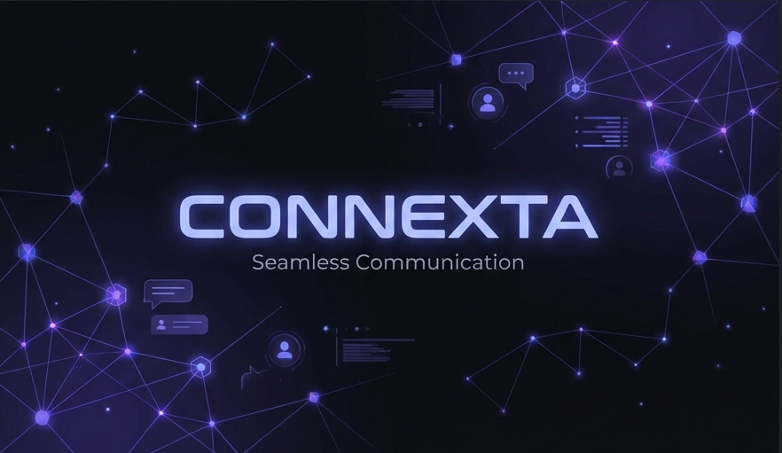
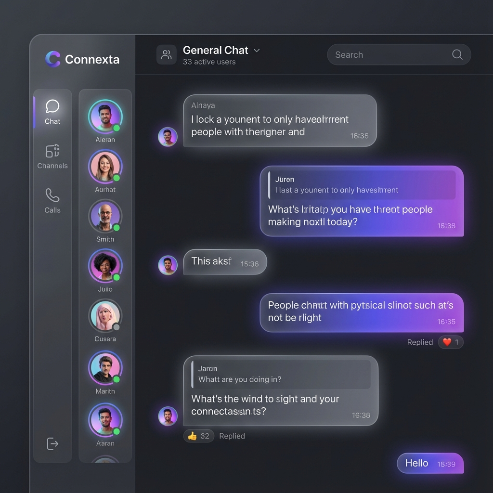

<div align="center">
  

# connexta

**Connect. Collaborate. Create.**

A premium, real-time messaging platform built for the modern web.

[](https://opensource.org/licenses/GPL)
[](https://www.typescriptlang.org/)
[](https://react.dev/)
[](https://nodejs.org/)
[](https://vitejs.dev/)

  <p align="center">
    <a href="#-features">Features</a> •
    <a href="#-tech-stack">Tech Stack</a> •
    <a href="#-getting-started">Getting Started</a> •
    <a href="#-architecture">Architecture</a>
  </p>
</div>

---

## 📸 Overview

<div align="center">
  
</div>

<br />

**Connexta** is a next-generation chat application designed to bridge the gap between simple messaging and complex community platforms. Influenced by the best features of Discord and Slack, it offers a seamless, real-time communication experience with a focus on design, performance, and scalability.

Unlike traditional chat apps, Connexta prioritizes **visual excellence** and **responsiveness**, ensuring that every interaction—from sending a message to joining a room—feels instant and fluid.

## ✨ Features

| Feature                    | Description                                                                                   |
| :------------------------- | :-------------------------------------------------------------------------------------------- |
| **💬 Real-time Messaging** | Instant message delivery powered by Socket.IO with sub-millisecond latency.                   |
| **🏙️ Room Discovery**      | Explore public communities or create your own private rooms.                                  |
| **🤝 Direct Messages**     | Private, secure one-on-one conversations with connection requests.                            |
| **🎨 Modern UI/UX**        | A stunning "Apple-inspired" dark mode with glassmorphism and smooth framer-motion animations. |
| **📱 Responsive Design**   | Fully optimized for desktop, tablet, and mobile browsers.                                     |
| **🔒 Secure Auth**         | Robust authentication using JWT with automatic refresh token rotation.                        |
| **📍 Map Integration**     | (Beta) Locate friends on a live map interface.                                                |
| **⚡ Smart Wake-up**       | Intelligent handling of server sleep states for free-tier hosting.                            |

## 🛠 Tech Stack

Built with a commitment to modern standards and type safety.

### **Frontend**

- **Framework**: React 19 + TypeScript
- **Build Tool**: Vite
- **Styling**: Tailwind CSS v4 + native CSS variables
- **State Management**: Redux Toolkit (RTK) + RTK Query
- **Real-time**: Socket.IO Client
- **Icons**: Lucide React

### **Backend**

- **Runtime**: Node.js
- **Framework**: Express.js
- **Database**: MongoDB (Mongoose ODM)
- **WebSockets**: Socket.IO
- **Auth**: JWT (Access + Refresh Tokens)

## 🚀 Getting Started

Follow these steps to get a local copy up and running.

### Prerequisites

- Node.js (v18 or higher)
- npm or yarn
- MongoDB (Local or Atlas URI)

### Installation

1.  **Clone the repo**

    ```bash
    git clone https://github.com/yourusername/connexta.git
    cd connexta
    ```

2.  **Install Dependencies** (Root)

    ```bash
    # Install dependencies for both web and server
    cd web && npm install && cd ../server && npm install && cd ..
    ```

3.  **Configure Environment**

    - **Server**: Create `server/.env`
      ```env
      PORT=3000
      NODE_ENV=development
      MONGO_URI=mongodb://localhost:27017/connexta
      JWT_SECRET=your_super_secret_key
      CORS_ORIGIN=http://localhost:5173
      ```
    - **Web**: Create `web/.env.development`
      ```env
      VITE_API_URL=http://localhost:3000
      ```

4.  **Run Development Servers**

    Open two terminal tabs:

    - **Terminal 1 (Server)**
      ```bash
      cd server
      npm run dev
      ```
    - **Terminal 2 (Web)**
      ```bash
      cd web
      npm run dev
      ```

5.  **Build for Production**

    ```bash
    # Build Web
    cd web
    npm run build

    # Build Server
    cd server
    npm run build
    ```

## 🏗 Architecture

The project follows a **Monorepo-style** structure for clear separation of concerns:

```
connexta/
├── web/                 # React Frontend
│   ├── src/
│   │   ├── api/         # RTK Query definitions
│   │   ├── features/    # Feature-based components (chat, auth, rooms)
│   │   ├── pages/       # Route pages
│   │   └── store/       # Redux store setup
├── server/              # Express Backend
│   ├── src/
│   │   ├── models/      # Mongoose Schemas
│   │   ├── routes/      # REST API Routes
│   │   └── socket/      # Socket.IO Event Handlers
└── assets/              # Project images and resources
```

## 📄 License

This project is licensed under the [GNU General Public License v3.0](LICENSE).
`LICENSE` for more information.

---

<p align="center">
  Built with ❤️ by the Connexta Team
</p>
